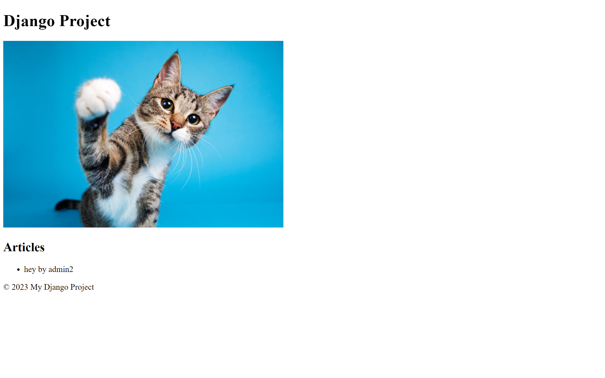

## Django Example App with DRF and Static Templates

Django example project with modular structure for loading different apps with their own views, models, and endpoints. Uses Django REST Framework for API requests, and templates with static assets to load content. Django admin dashboard will let you create data to be served from the API.




## Installation

Make a virtual env, and run:

`pip install -r requirements.txt`

Or:

```
pip install django
pip install djangorestframework
```

## Commands

Migrate data from your apps:

`python manage.py makemigrations example_app`

Create admin / superuser:

`python manage.py createsuperuser`

Run the Django app and server:

`python manage.py runserver`

## Database

Currently uses SQLite for database. The db and engine can be changed on lines 91 in `project/settings.py`.

You can create `Article` objects with `title` (str), `content` (str), and `author` (User) in the admin dashboard.

## URLs

Register your URLs and view components in `/project/urls.py`.

- `http://localhost:8000/` takes you to homepage with template and static assets rendered.

- `http://localhost:8000/article_list` renders list of articles from the database.

- `http://localhost:8000/user_list` renders list of users from the database.

- `http://localhost:8000/api` takes you to API root UI provided by DRF.

- `http://localhost:8000/admin` takes you to Django admin page to login.

## API

Add your API endpoints to `/projects/urls.py` with the Router. All API endpoints currently served under `/api/`.

- `http://localhost:8000/api/articles` serves articles from database.

- `http://localhost:8000/api/users` serves users from database.

- `http://localhost:8000/api/groups` serves user groups from database.

## Authentication

Uncomment authentication in `/project/settings.py` on lines 102 to add token authentication or session authentication to the API. By default it's unprotected.